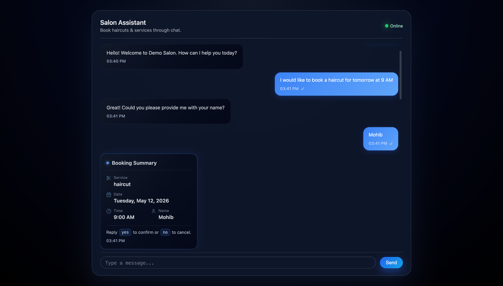
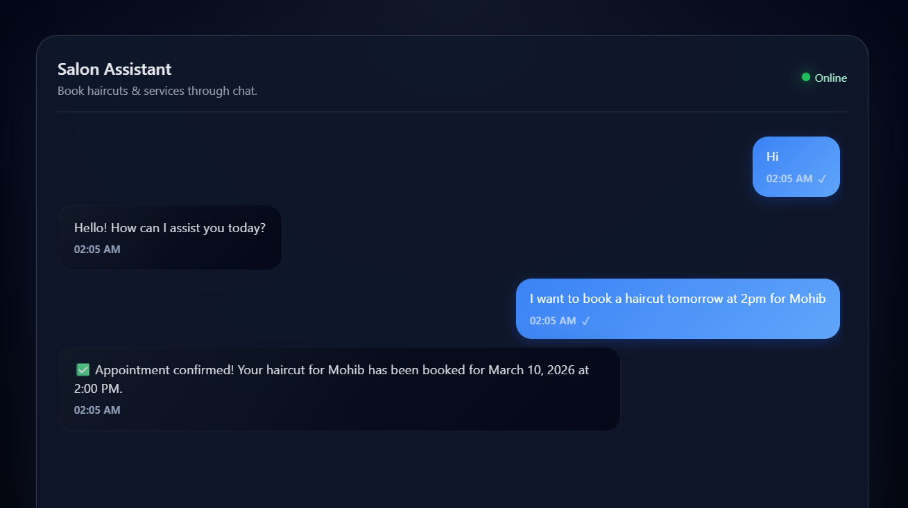
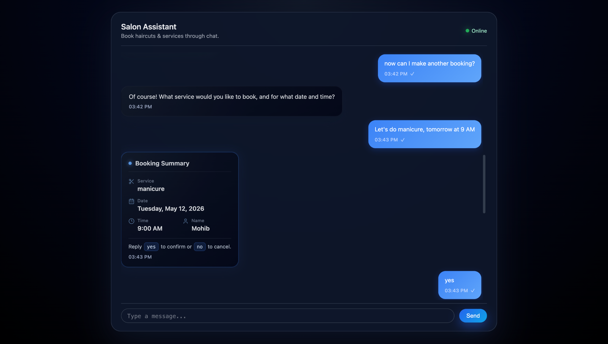
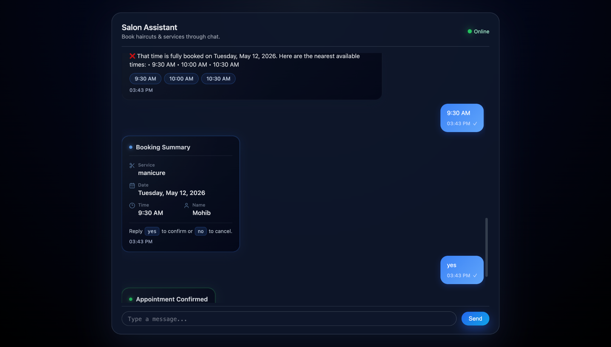
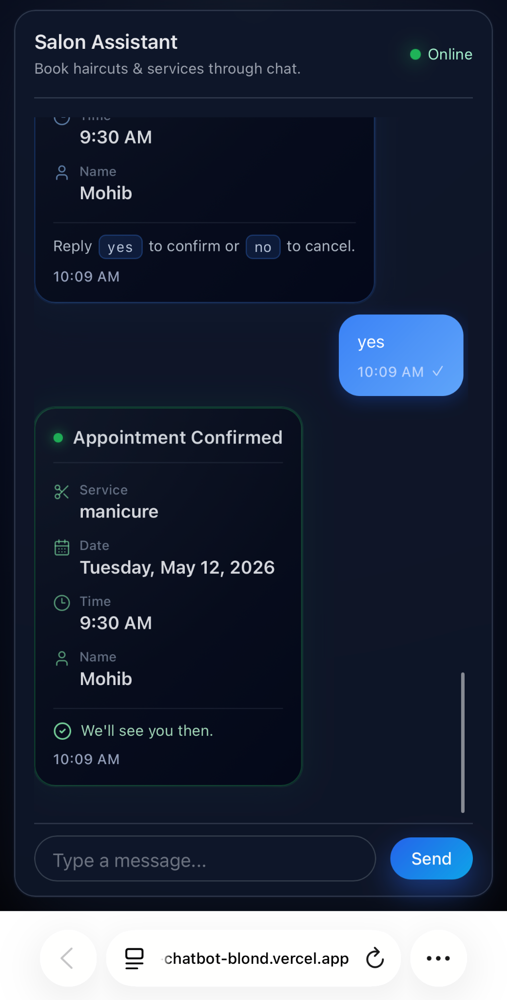

# AI Appointment Chatbot

AI Appointment Chatbot is a full-stack conversational booking system that allows users to schedule salon services using natural language. The application combines an LLM-powered conversational interface with deterministic backend business logic to create a reliable appointment booking workflow.

The system demonstrates how conversational AI can be integrated with real backend business logic while maintaining validation, state management, and production-aware frontend behavior.

## Live Demo

[View Live Demo](https://ai-appointment-chatbot-blond.vercel.app/)

## Overview

The AI Appointment Chatbot allows users to book appointments through a conversational interface rather than traditional forms. Users can describe services naturally (for example: "Book a haircut tomorrow at 9AM"), while the backend validates requests against scheduling rules before confirming the booking.

Key capabilities include:

- Natural language appointment booking
- Automatic extraction of booking details (name, service, date, time)
- Business hours validation
- Blackout day handling
- Time-slot conflict detection
- Alternative time suggestions when conflicts occur
- Confirmation-gated booking flow
- Persistent booking storage with SQLite
- Mobile-responsive conversational UI
- Cross-device session handling support
- Structured booking summary cards
- Interactive suggestion chips
- Typing indicators and animated chat responses

---

## Screenshots

### Initial Booking Flow



### Successful Booking



### Second Booking Attempt



### Conflict Detection + Smart Suggestions



### Mobile Responsive Interface



---

## Tech Stack

### Frontend
- React
- Vite
- CSS3
- Responsive mobile-first layout

### Backend
- Node.js
- Express.js
- SQLite
- OpenAI API

### Deployment
- Vercel (Frontend)
- Render (Backend)

---

## Features

### Conversational Booking Flow

Users can interact naturally with the chatbot instead of filling traditional forms.

Examples:
- "Book a haircut tomorrow at 9AM"
- "Can I get a manicure on Friday afternoon?"
- "Let's do 10:30 instead"

The AI extracts booking information while the backend validates all business rules.

---

### Conflict Detection

The backend prevents overbooking by checking slot capacity before confirming appointments.

If a requested slot is unavailable, the chatbot automatically suggests nearby available times.

Example:
- Requested: 9:00 AM
- Suggested alternatives:
  - 9:30 AM
  - 10:00 AM
  - 10:30 AM

---

### Confirmation-Gated Booking

Appointments are never written directly to the database after extraction.

Instead, the system:
1. Collects booking information
2. Generates a structured booking summary
3. Waits for explicit user confirmation
4. Saves only after a confirmed "yes"

This prevents accidental bookings and creates a safer conversational workflow.

---

### Responsive Mobile UI

The frontend was specifically optimized for mobile Safari and iOS behavior.

Features include:
- Dynamic viewport height (`100dvh`)
- Safe-area handling using `env(safe-area-inset-*)`
- iOS input zoom prevention
- Keyboard-aware layout adjustments
- Scrollable chat history
- Mobile-safe input positioning

---

### Session Persistence Across Devices

Desktop browsers typically support cookie-based sessions normally.

Mobile Safari introduced a real production issue because Intelligent Tracking Prevention (ITP) blocks third-party cookies between:
- Vercel frontend
- Render backend

To solve this:
- The frontend generates a persistent `conversationId`
- The ID is stored in `localStorage`
- Every request includes the ID
- Backend state is resolved through a shared abstraction layer

This allows conversations to persist correctly even when cookies fail.

---

## Architecture

The system separates:
- conversational AI behavior
- deterministic backend business logic

The AI handles:
- natural language understanding
- conversational responses
- extraction of structured intent

The backend handles:
- scheduling validation
- date resolution
- slot conflict detection
- persistence
- booking confirmation
- session state

This architecture keeps critical business logic deterministic and testable.

---

## Key design decisions

### Server owns date resolution, not the LLM

The AI emits raw phrases (`"tomorrow"`, `"Friday"`, `"May 9"`) in its JSON payload. The server resolves them to concrete ISO dates using dayjs anchored to the business timezone. This prevents LLM hallucination of dates, handles edge cases like late-night requests crossing midnight correctly, and means timezone math is testable code instead of prompt engineering.

---

### Confirmation gate prevents accidental bookings

The booking flow has explicit states:

`collecting → awaitingConfirmation → saved`

The user must reply `"yes"` (matched as the whole message, not as a substring) to a structured summary before anything writes to the database.

The yes/no regex tolerates trailing punctuation but not extra words — so `"ok so actually 3pm"` does not accidentally confirm the booking.

---

### Structured response types, not regex parsing of LLM prose

Booking summaries and confirmed bookings ship as structured response fields:
- `messageType`
- `bookingDraft`
- `suggestions`

The frontend renders dedicated UI components from structured data instead of parsing natural-language responses.

The conversational reply is preserved as fallback behavior for graceful degradation.

---

### Dual-store session abstraction

Mobile Safari's Intelligent Tracking Prevention blocks third-party cookies between a Vercel frontend and Render backend, breaking standard `express-session`.

The solution:
- The frontend generates a stable `conversationId` (UUID)
- The ID is stored in `localStorage`
- Requests include the `conversationId`
- The backend exposes a `getState(req)` abstraction

Desktop users use the normal session path.

Mobile users use the Map-keyed path.

Both stores expose the same interface, making the rest of the handler storage-agnostic.

---

### CSS-only animations and responsive design

The interface uses:
- CSS animations only
- no animation libraries

Bubble transitions use lightweight fade + slide animations via `@keyframes`.

Mobile layout uses:
- `100dvh`
- `safe-area-inset`
- responsive breakpoints
- 16px mobile input font sizing to prevent iOS auto-zoom

---

## Database Design

Appointments are stored in SQLite.

Each booking contains:
- Name
- Service
- Date
- Time
- Phone number
- Creation timestamp

The backend validates:
- business hours
- blackout dates
- slot capacity
- duplicate conflicts

before insertion.

---

## What this project demonstrates

This project focuses on combining conversational AI with real backend business logic:

- **LLM integration with deterministic guardrails** — using AI for natural language understanding while keeping business logic, dates, and persistence in plain backend code
- **Stateful conversation design** — explicit state machine with confirmation gating, draft merging, and conflict-aware flows
- **Cross-platform session handling** — diagnosing and solving real mobile Safari cookie/session issues with a clean abstraction
- **Production frontend polish** — responsive design, mobile viewport handling, iOS zoom prevention, structured UI rendering
- **Structured AI architecture** — AI outputs structured payloads while backend systems remain deterministic
- **Real deployment experience** — deployed frontend/backend architecture with environment configuration and cross-origin handling
- **Backend validation systems** — scheduling rules enforced independently of AI responses

---

## Known limitations

This project was built as an MVP, so there are still some limitations and production considerations worth noting:

- **In-memory state stores.** Both the conversation Map and `express-session`'s default `MemoryStore` lose all active conversations on restart. Redis or a persistent DB-backed store would be required for production scaling.
- **Session TTL is temporary.** Long inactive conversations eventually expire and restart.
- **No rate limiting.** The API currently accepts unlimited requests.
- **Conversation IDs are not cryptographically signed.** A production system should validate ownership server-side.
- **No formal accessibility audit.** Semantic HTML is used, but screen-reader testing was not completed.
- **LLM prompt stability matters.** The booking flow assumes structured JSON output from the model.

---

## Future Improvements

Potential future enhancements include:

- Google Calendar integration
- SMS / email confirmations
- User authentication
- Multi-business support
- Admin dashboard
- Real-time availability calendar
- Payment integration
- Redis-backed session storage
- AI memory personalization
- Analytics dashboard
- Voice booking support
- Multi-language support

---

## Installation

### Clone the repository

```bash
git clone https://github.com/yourusername/ai-appointment-chatbot.git
cd ai-appointment-chatbot
```

### Install dependencies

Frontend:

```bash
cd frontend
npm install
```

Backend:

```bash
cd backend
npm install
```

---

## Environment Variables

Create a `.env` file in the backend directory:

```env
OPENAI_API_KEY=your_api_key
SESSION_SECRET=your_secret
PORT=5000
```

---

## Running Locally

### Start backend

```bash
npm run server
```

### Start frontend

```bash
npm run dev
```

---

## Deployment

Frontend is deployed on Vercel.

Backend is deployed on Render.

Production configuration includes:
- CORS handling
- session configuration
- environment variables
- mobile-safe session persistence

---

## Author

**Mohib Zaidi**  
Software Engineering Co-op Student  
University of Alberta
